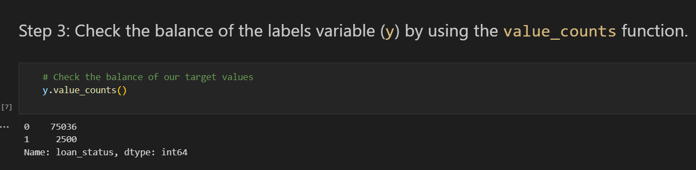
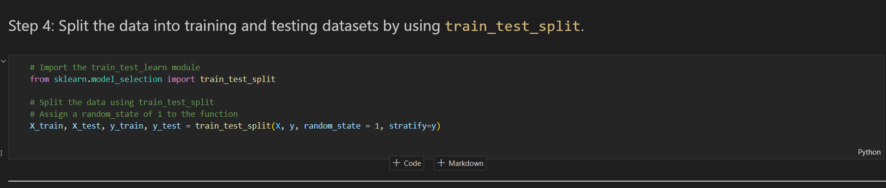
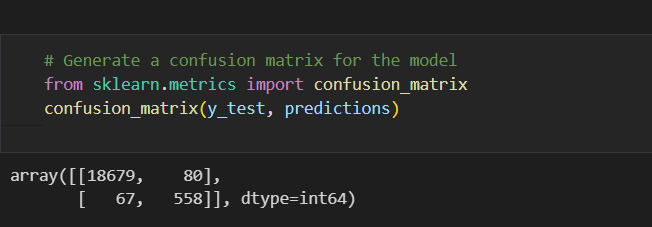
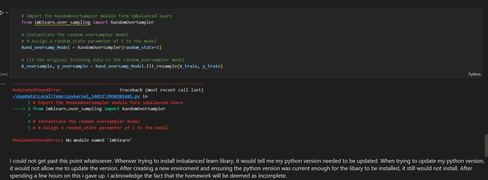

# Credit-risk-classification

The instructions for this Challenge are divided into the following subsections:

Split the Data into Training and Testing Sets

Create a Logistic Regression Model with the Original Data

Predict a Logistic Regression Model with Resampled Training Data

Write a Credit Risk Analysis Report

# Split the Data into Training and Testing Sets

Open the starter code notebook and use it to complete the following steps:

Read the lending_data.csv data from the Resources folder into a Pandas DataFrame.

Create the labels set (y) from the “loan_status” column, and then create the features (X) DataFrame from the remaining columns.

Split the data into training and testing datasets by using train_test_split.

# Create a Logistic Regression Model with the Original Data

Use your knowledge of logistic regression to complete the following steps:

Fit a logistic regression model by using the training data (X_train and y_train).

Save the predictions for the testing data labels by using the testing feature data (X_test) and the fitted model.

Evaluate the model’s performance by doing the following:

Calculate the accuracy score of the model.
Generate a confusion matrix.
Print the classification report.

Answer the following question: How well does the logistic regression model predict both the 0 (healthy loan) and 1 (high-risk loan) labels?

# Write a Credit Risk Analysis Report

# Write a brief report that includes a summary and analysis of the performance of the machine learning models that you used in this homework. You should write this report as the README.md file included in your GitHub repository.

Structure your report by using the report template that Starter_Code.zip includes, ensuring that it contains the following:

An overview of the analysis: Explain the purpose of this analysis.

The results: Using a bulleted list, describe the accuracy score, the precision score, and recall score of the machine learning model.

A summary: Summarize the results from the machine learning model. Include your justification for recommending the model for use by the company. If you don’t recommend the model, justify your reasoning.

# Overview of the Analysis

Lending companies lend money to borrowers expecting them to complete the lending process as agreed upon. Credit risk is a measurement which lending companies use to determine whether a customer can afford the loan which considers many factors. This analysis will use a dataset of historical lending activity from a peer-to-peer lending company to build a model that can identify the creditworthiness of borrowers.

The purpose of this report is to investigate the relationship between training imbalanced data and over sampling, and determining if it makes a difference through logistic regression machine learning algorithms.

Logistic regression is a supervised learning algorithm that is used to predict a categorical variable based on one or more predictor variables. The goal is to find the best set of coefficients that minimize the difference between the predicted attitude and the actual class labels.

